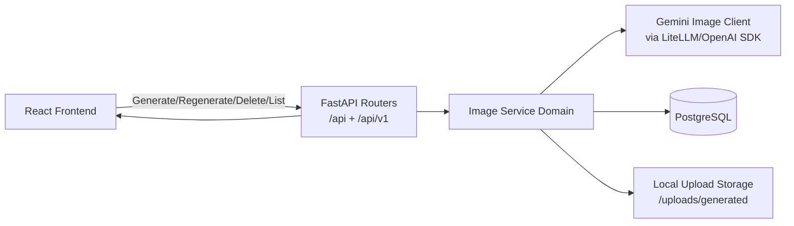

# Project 6: Enterprise AI Image Generation Extension

## 1) Full Architecture Explanation

This implementation extends the existing FastAPI + LangChain + PostgreSQL + React platform with a modular image-generation domain, keeping current chat behavior intact.

### Team Ownership and Module Boundaries

- System Architect / Tech Lead
  - Owns API versioning, module boundaries, deployment topology, observability strategy, environment standards.
- Backend API Engineer
  - Owns versioned image APIs under /api/v1, request/response contracts, dependency wiring, error handling, rate limiting.
- AI/LLM Engineer
  - Owns Gemini image provider wrapper, prompt enhancement policy, retry strategy, provider abstraction.
- Database Engineer
  - Owns generated_images and image_generation_logs schema, indexes, migration lifecycle, data retention.
- Frontend Engineer
  - Owns image modal, gallery, regenerate/delete/download UX, thread integration.
- DevOps Engineer
  - Owns secrets, storage/CDN, CI/CD rollout, environment matrices, runtime telemetry.
- Security Engineer
  - Owns prompt safety policy, abuse prevention, endpoint hardening, audit logs.
- QA/Automation Engineer
  - Owns API tests, UI tests, integration tests, and load/perf checks.

### High-Level Component Diagram

### Request Lifecycle (Generate)

1. Frontend opens prompt modal and posts to POST /api/v1/images/generate.
2. API authenticates user via existing cookie-based auth and enforces rate limiting.
3. Service resolves thread ownership or creates new thread if thread_id is missing.
4. Service sanitizes and safety-checks prompt.
5. Optional prompt enhancement appends style/aspect instructions.
6. Gemini wrapper performs generation with retries.
7. Service stores image binary to /uploads/generated and inserts generated_images record.
8. Service writes audit record to image_generation_logs.
9. Service stores a chat assistant message with attachment to preserve chat/thread continuity.
10. API returns thread_id and generated image metadata.

## 2) Folder Structure

### Backend (current + new additions)

- backend/app/api/v1/routes/images.py
- backend/app/api/v1/dependencies/rate_limit.py
- backend/app/services/ai/gemini_image_client.py
- backend/app/services/images/image_service.py
- backend/app/db/repositories/image_repository.py
- backend/app/models/generated_image.py
- backend/app/models/image_generation_log.py
- backend/app/schemas/image.py
- backend/alembic/versions/0002_image_generation.py

### Frontend (current + new additions)

- frontend/src/components/images/ImageGenerationPanel.tsx
- frontend/src/components/images/ImageGallery.tsx
- frontend/src/components/modals/ImagePromptModal.tsx
- frontend/src/lib/endpoints.ts (imageApi)
- frontend/src/types/index.ts (image DTOs)
- frontend/src/components/chat/ChatContainer.tsx (integration)

## 3) Backend Implementation Summary

- Added versioned API endpoints under /api/v1.
- Implemented service layer with strict separation:
  - Router: HTTP contract and auth/dependency plumbing.
  - Service: generation orchestration and business rules.
  - Repository: persistence operations.
  - AI client wrapper: provider concerns and retries.
- Added in-memory rate limiter dependency suitable for single-instance deployments; document replacement with Redis for distributed deployments.

## 4) Frontend Implementation Summary

- Added reusable image generation panel integrated with current chat screen.
- Added prompt modal with style/aspect ratio/prompt enhancement controls.
- Added image gallery with:
  - thread-scoped history
  - retry (regenerate)
  - delete
  - download
  - loading and error states
- Preserved existing chat interaction and auth/session model.

## 5) DB Schema

### Table: generated_images

Columns:
- id (UUID PK)
- user_id (FK users.id)
- thread_id (FK threads.id)
- prompt
- enhanced_prompt
- image_url
- status
- generation_time_ms
- style
- aspect_ratio
- model_name
- source_image_id (self FK)
- error_message
- created_at

Indexes:
- ix_generated_images_user_id
- ix_generated_images_thread_id
- ix_generated_images_user_created (user_id, created_at)
- ix_generated_images_thread_created (thread_id, created_at)
- ix_generated_images_status

### Table: image_generation_logs

Columns:
- id (UUID PK)
- generated_image_id (FK generated_images.id)
- user_id (FK users.id)
- thread_id (FK threads.id)
- status
- event_type
- safety_blocked
- provider_latency_ms
- error_code
- error_message
- request_payload (JSONB)
- response_payload (JSONB)
- created_at

Indexes:
- ix_image_generation_logs_generated_image_id
- ix_image_generation_logs_user_id
- ix_image_generation_logs_thread_id
- ix_image_logs_user_created (user_id, created_at)
- ix_image_logs_thread_created (thread_id, created_at)
- ix_image_logs_status

## 6) API Contracts

### POST /api/v1/images/generate
Request:
- prompt
- thread_id (optional)
- style
- aspect_ratio
- enhance_prompt

Response:
- thread_id
- image: GeneratedImageResponse

### GET /api/v1/threads/{id}/images
Response:
- list of GeneratedImageResponse (newest first)

### DELETE /api/v1/images/{id}
Response:
- deleted: true
- image_id

### POST /api/v1/images/regenerate
Request:
- image_id
- prompt_override (optional)
- style (optional)
- aspect_ratio (optional)
- enhance_prompt

Response:
- thread_id
- image: GeneratedImageResponse

## 7) LangChain/Gemini Integration

- Implemented provider wrapper: GeminiImageClient.
- Uses configured model from IMAGE_GEN_MODEL.
- Retry logic with exponential backoff.
- Normalizes provider responses supporting both b64_json and URL outputs.
- Keeps prompt metadata context for observability and tracing.

## 8) Security Strategy

Implemented now:
- Existing authenticated user dependency reused for all image APIs.
- User-scoped ownership checks for thread and image access.
- Prompt sanitization and basic blocked-terms safety gate.
- API rate limiting guard.
- Audit log table for traceability.

Production hardening roadmap:
- Replace in-memory rate limiter with Redis token bucket.
- Add provider-native content moderation pre/post checks.
- Add prompt/response redaction policy for PII in logs.
- Add signed URLs and private object storage for generated assets.

## 9) Deployment Approach

### Runtime Strategy

- Backend containers run FastAPI + workers.
- Generated images move from local disk to object storage (S3/GCS/Azure Blob).
- CDN serves generated assets.
- DB migration job runs before app rollout.

### Environment Variables

- IMAGE_GEN_MODEL
- IMAGE_GEN_MAX_RETRIES
- IMAGE_GEN_RATE_LIMIT_PER_MINUTE
- IMAGE_GEN_PROMPT_MAX_LENGTH
- LITELLM_PROXY_URL / LITELLM_API_KEY
- PUBLIC_BASE_URL

### Observability

- Emit structured logs with request IDs, user IDs, thread IDs.
- Export metrics: generation latency, success/failure ratio, safety blocks, rate-limit hits.
- Capture traces around provider calls and storage persistence.

## 10) Testing Strategy

### Backend

- Unit tests:
  - prompt sanitization and enhancement
  - safety checks
  - repository CRUD behavior
- API tests:
  - generate/regenerate/delete/list happy paths
  - auth and ownership checks
  - rate-limit behavior
  - provider failure mapping to 502

### Frontend

- Component tests:
  - ImagePromptModal form behavior
  - ImageGallery actions and state rendering
- Integration tests:
  - chat thread switch loads associated image history
  - generation creates/links thread correctly

### E2E

- Login -> generate image -> regenerate -> download -> delete
- Multi-thread isolation of image history
- Failure + retry scenario validation

## 11) Example Workflows

### A) Generate in New Thread

1. User opens chat page with no active thread.
2. User opens image modal and submits prompt.
3. Backend creates thread, generates image, stores image and log.
4. Frontend receives thread_id, switches context, and renders image history.

### B) Regenerate Variant

1. User selects Retry on an image tile.
2. Frontend calls /api/v1/images/regenerate.
3. Backend generates a new record linked with source_image_id.
4. Gallery updates with latest variant at top.

### C) Delete

1. User clicks Delete on image card.
2. Backend validates ownership, deletes file and DB record, logs delete event.
3. Frontend refreshes thread images.

## 12) Production Recommendations

- Move generated files to cloud object storage and serve with signed URLs/CDN.
- Replace local in-memory limiter with distributed Redis-based limiter.
- Add asynchronous job queue for generation bursts and backpressure management.
- Introduce provider failover abstraction for multi-model resilience.
- Add per-tenant quotas and cost dashboards.
- Add archival/retention policy for image_generation_logs and generated_images.
- Add canary deployments for model/prompt policy updates.
