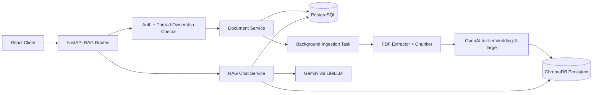

# Project 7: PDF Chat Using RAG

## 1. Architecture Design

## 2. Folder Structure

### Backend additions
- app/api/v1/routes/rag.py
- app/schemas/rag.py
- app/services/rag/
- app/models/document.py
- app/models/document_chunk.py
- app/models/rag_chat_history.py
- app/models/document_processing_log.py
- app/db/repositories/rag_repository.py
- alembic/versions/0003_pdf_rag.py

### Frontend additions
- src/components/rag/PDFUploader.tsx
- src/components/rag/DocumentSidebar.tsx
- src/components/rag/DocumentCard.tsx
- src/components/rag/SourceCitation.tsx
- src/components/rag/RAGChatWindow.tsx

## 3. FastAPI Implementation

Implemented routes:
- POST /api/v1/rag/upload
- POST /api/v1/rag/chat
- GET /api/v1/rag/documents?thread_id=<uuid>
- DELETE /api/v1/rag/documents/{id}?thread_id=<uuid>

Design highlights:
- Auth-protected via existing cookie/JWT dependency
- Thread ownership enforcement for all operations
- Multipart upload with server-side PDF validation
- Async background indexing after upload acceptance

## 4. LangChain RAG Pipeline

Pipeline used:
1. Extract text with pypdf
2. Split with RecursiveCharacterTextSplitter
3. Embed using OpenAIEmbeddings model text-embedding-3-large (via LiteLLM proxy)
4. Store vectors + metadata in ChromaDB
5. Retrieve top-k chunks with metadata filters
6. Generate grounded answer with LLM prompt guardrails

## 5. ChromaDB Integration

- Persistent client path: CHROMA_PERSIST_DIR
- Collection strategy: per user + thread
- Per-chunk metadata stored:
  - user_id
  - thread_id
  - document_id
  - filename
  - page_number
  - chunk_id
  - created_at

## 6. OpenAI Embeddings Integration

- Uses existing langchain_openai.OpenAIEmbeddings
- Model: text-embedding-3-large
- Configured via existing LiteLLM base URL + API key

## 7. SQLAlchemy Models

Added models:
- documents
- document_chunks
- rag_chat_history
- document_processing_logs

## 8. Alembic Migration

- Added migration 0003_pdf_rag.py
- Includes table creation and operational indexes for user/thread/document lookups

## 9. React Frontend Implementation

Features delivered:
- PDF uploader with upload progress
- Thread document sidebar with status chips and delete actions
- RAG chat window
- Citation cards with source/page/score preview
- Thread-linked document management

## 10. API Contracts

### POST /api/v1/rag/upload
- multipart/form-data:
  - thread_id: UUID
  - file: PDF
- Response: document metadata + queued message

### POST /api/v1/rag/chat
- JSON:
  - thread_id
  - question
  - top_k (optional)
  - document_ids (optional)
- Response:
  - answer
  - confidence
  - grounded
  - citations[]

### GET /api/v1/rag/documents
- Query: thread_id
- Response: list of documents and indexing status

### DELETE /api/v1/rag/documents/{id}
- Query: thread_id
- Response: deletion status

## 11. Security Strategy

- Strict PDF extension + MIME validation
- Upload size restrictions using RAG_MAX_UPLOAD_MB
- Thread and user isolation for all document operations
- Prompt-injection hardening via extracted text sanitization
- Secure server-side storage paths with sanitized names

## 12. Testing Strategy

Added baseline pytest coverage:
- tests/rag/test_document_processor.py
- tests/rag/test_rag_service_utils.py

Recommended expansion:
- API integration tests for all RAG routes
- hallucination fallback assertions
- retrieval precision/recall datasets
- load tests for concurrent uploads/questions

## 13. Deployment Setup

- Persist PostgreSQL and ChromaDB volumes
- Run backend with async workers
- Add health checks and alerting around indexing failures
- Keep upload storage on durable disk/object storage (future)

## 14. Docker Setup

- Added docker-compose.rag.yml
- Added backend/Dockerfile
- Added frontend/Dockerfile

## 15. Example Workflow

1. User selects thread
2. User uploads PDF from Document Sidebar
3. API returns queued status
4. Background task extracts/chunks/embeds/indexes
5. Status moves to processed
6. User asks question in RAG chat window
7. API retrieves top-k chunks and returns grounded answer with citations

## 16. Production Recommendations

- Move ingestion to durable queue workers (Celery/RQ/Arq)
- Add OCR worker path for scanned PDFs (Tesseract/Azure Form Recognizer)
- Add reranker model for precision
- Add tenant-level quotas and retention policies
- Add tracing (OpenTelemetry) for ingestion and retrieval latency
- Add nightly vector consistency audit
