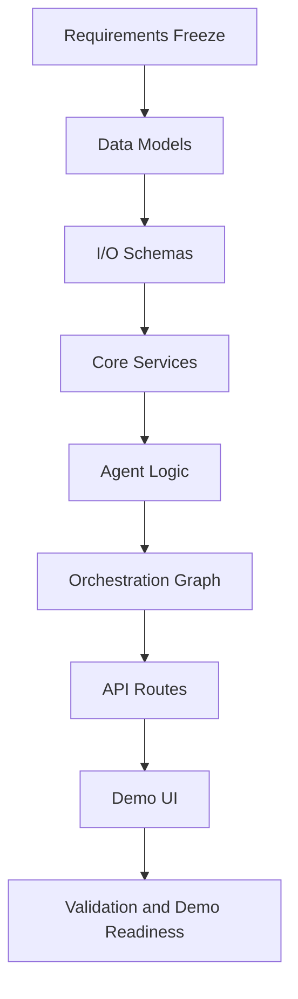

# DEPENDENCIES.md

## Dependency Rule
The build order is strict: models -> schemas -> services -> agents -> graphs -> routes -> UI.

## Phase-Wise Dependency Graph

## Feature Dependency Matrix
1. Behavior Tracking Feature
   - Depends on: models, event schema, ingestion service, event route.
2. Segmentation Feature
   - Depends on: behavior data model, profile schema, segmentation service.
3. Recommendation Feature
   - Depends on: segmentation outputs, product model, recommendation service.
4. Dynamic Pricing Feature
   - Depends on: recommendation outputs, inventory model, pricing service.
5. Content Personalization Feature
   - Depends on: segment outputs, page context schema, content service.
6. Orchestrator
   - Depends on: all feature services + trace persistence model.
7. UI Demo Panel
   - Depends on: orchestrator route + trace and profile routes.

## Must-Exist-Before Rules
1. No route creation before service interfaces are stable.
2. No UI integration before orchestrator response schema is frozen.
3. No checkpoint closure without persistence and traceability proof.
4. No stretch implementation before all in-scope checkpoints are green.

## Critical Path
1. Requirements freeze.
2. Data model and schema freeze.
3. Segmentation + recommendation services.
4. Pricing + content services.
5. Orchestrator and trace persistence.
6. UI integration and full validation.